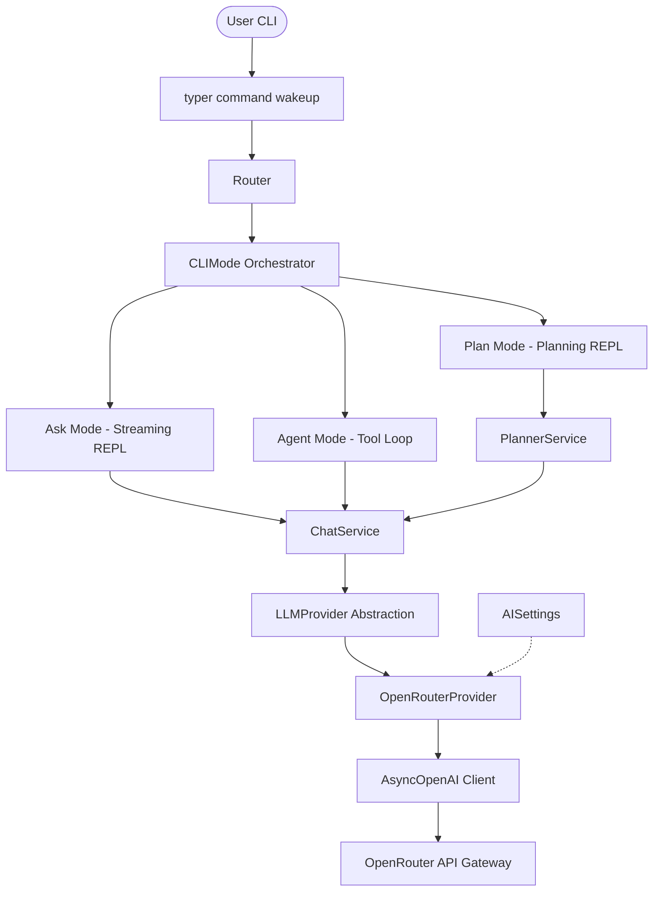

# Nakama-kun: Project State & Architecture

`nakama_kun` is an OpenClaw-inspired terminal AI Agent framework written in Python 3.12+, designed to act as your "nakama" (partner/companion) in the terminal.

---

## 1. Current Phase: Phase 5 (Planning Agent)

The project has successfully reached **Phase 5: Planning Agent**.

### Completed Phases & Features
* **Phase 1: CLI Foundation & UI**
  * Implemented Typer CLI entry points.
  * Added ASCII startup banner using `pyfiglet` and `rich`.
  * Integrated interactive Questionary menus styled with a consistent terminal color palette.
* **Phase 2: Multi-Mode Router Architecture**
  * Implemented an abstract `BaseMode` interface following SOLID compliance.
  * Built a central `Router` to manage mode transitions (BACK, EXIT, SWITCH).
  * Structured hierarchical CLI sub-menus routing to placeholder implementations for **Agent Mode**, **Plan Mode**, and **Ask Mode**.
  * Added a **Telegram Mode** stub for future bot integrations.
* **Phase 3: AI Integration Layer (Primary: OpenRouter)**
  * Established a provider-agnostic `LLMProvider` interface.
  * Built `OpenRouterProvider` wrapping `AsyncOpenAI` pointing to the OpenRouter gateway.
  * Created a high-level `ChatService` with context/history compilation and Loguru telemetry (latency, token tracking, errors).
  * Added real-time token streaming to **Ask Mode** rendered dynamically as Markdown inside `rich.live`.
  * Wrote a centralized **Model Registry** mapping friendly aliases (e.g. `gpt5`, `r1`, `claude`) to full OpenRouter model paths.
  * Secured loose coupling with constructor-based Dependency Injection.
  * Fully covered the new layer with isolated unit tests (`pytest`).
* **Phase 4: Tool Calling Framework**
  * Built workspace safety constraint check (`assert_within_workspace`) to prevent path escape.
  * Implemented registry and router for workspace tools.
  * Implemented five core tools: `read_file`, `write_file`, `list_files`, `search_files`, and `run_command` (guarded by timeouts).
  * Built autonomous Agent Mode loop running up to 10 iterations to solve goals.
* **Phase 5: Planning Agent**
  * Created structured `Plan` model for goal summaries, assumptions, steps, risks, checklist, and targets.
  * Implemented `PlannerService` maintaining separate planning session history.
  * Replaced Plan Mode stub with an interactive REPL loop.
  * Built high-fidelity Rich rendering of plans with target files, steps, risks, and validation checklists.

---

## 2. Core Architecture Diagram

The system operates on a decoupled architecture where modes depend on abstractions, permitting seamless swapping of underlying models, providers, and integrations:

---

## 3. Supported Modes Status

| Mode | Status | Description / Behavior |
| :--- | :--- | :--- |
| **Ask Mode** | **Fully Functional** | Starts a streaming chat loop. Translates model outputs to live Markdown. Exits with `exit` or `back`. |
| **Agent Mode** | **Fully Functional** | Autonomous execution loop utilizing workspace tools. Safe path verification and tool execution up to 10 rounds. |
| **Plan Mode** | **Fully Functional** | Interactive task decomposition REPL. Outputs structured plans rendered beautifully inside Rich panels. |
| **Telegram Mode** | **Placeholder** | Confirms mode selection and returns back to the main menu. Will host a polling bot in Phase 7. |

---

## 4. Configuration Details

Configuration is loaded and validated on-demand using `pydantic-settings` from the environment or a `.env` file in the workspace root:

* `OPENROUTER_API_KEY`: API authentication key. Raises a clean error message `OpenAI API key not found` if absent when accessing AI-dependent modes.
* `OPENROUTER_MODEL`: Friendly registry key (`gpt5`, `claude`, `opus`, `gemini`, `r1`) or a raw model path (e.g., `openai/gpt-5`).
* `OPENROUTER_BASE_URL`: Base API endpoint (defaults to `https://openrouter.ai/api/v1`).

---

## 5. Centralized Telemetry & Logging

Centralized logs are maintained at `logs/nakama_kun.log` and track the following metrics:
* AI Layer initialization sequences.
* Provider requests, payload message counts, and input roles.
* Response latencies (measured in seconds).
* Token usage statistics (prompt, completion, and total tokens).
* Precise exception messages and HTTP failures.

---

## 6. Project Roadmap

1. **Phase 4: Tool Calling & MCP** [Completed]
   * Introduce structured tool calling schemas (already prepared in Phase 3 `Message` / `ToolCall` models).
   * Implement agentic tool execution loop.
2. **Phase 5: Planning Agent** [Completed]
   * LLM-driven task breakdown and REPL planner.
3. **Phase 6: Workspace Awareness**
   * File system context indexing.
4. **Phase 7: Telegram Integration**
   * Fully async Telegram Bot command dispatcher.
5. **Phase 8: Memory**
   * Local short/long-term conversation state storage.
6. **Phase 9: RAG**
   * Retrieval-Augmented Generation capabilities.
7. **Phase 10: Multi-Agent System**
   * Orchestrate planner, coder, reviewer, and executor sub-agents.

