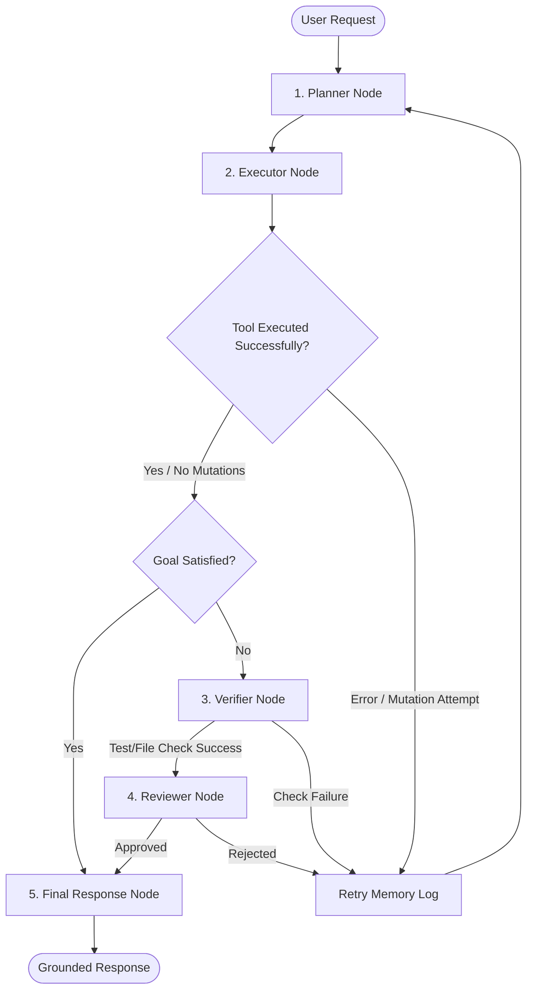

# Nakama-kun 🤖

> **Your nakama in the terminal** — A verification-driven, terminal-first autonomous AI coding agent that plans, executes, validates, reviews, learns from failures, and reports only grounded results.

[](https://www.python.org)
[](https://docs.astral.sh/uv/)
[](LICENSE)
[](https://github.com/langchain-ai/langgraph)
[](https://typer.tiangolo.com)

---

## 📖 Overview

**Nakama-kun** (meaning *companion* or *colleague* in Japanese) is an OpenClaw-inspired autonomous AI assistant optimized for the developer terminal. Unlike generic LLM wrappers, Nakama-kun is built from the ground up on the principle of **verification-driven execution**. It doesn't just run tools and hope for the best; it systematically validates its work, reviews implementation quality, catches safety violations, dynamically learns from errors in-memory, and provides fully-grounded RAG/evidence reports.

```
┌────────────────────────────────────────────────────────────────────────┐
│                                                                        │
│   [PLAN] ──> [EXECUTE] ──> [VERIFY] ──> [REVIEW] ──> [GROUNDED REPORT] │
│                 │              │            │                          │
│                 └──────────────┴────────────┴─ (Re-Plan on Failures)   │
│                                                                        │
└────────────────────────────────────────────────────────────────────────┘
```

---

## 🌟 Key Features & Differentiators

*   🛡️ **Verification-Driven Execution**: Every single file modification, file creation, or command output is cross-checked against the workspace. It parses test logs (e.g. `pytest`) to verify functionality before proceeding.
*   🧠 **In-Memory Retry System**: Remembers tool failures, validation errors, and syntax issues in the current execution loop, automatically feeding this context back to the planning and executor stages to avoid repetitive mistakes.
*   🔒 **Retrieval Safety Guard**: Intelligently locks workspace mutations when executing pure search or retrieval tasks, ensuring zero unintended file modifications or environment writes.
*   🔍 **Immutable Evidence Store**: Collects read segments, written contents, command outputs, and directory trees, ensuring the final output is grounded strictly in evidence to eradicate hallucinations.
*   ⚡ **Early-Stop Execution**: Evaluates goal satisfaction after every single tool call. If the target condition is met, it halts immediately, bypassing costly nodes to minimize API overhead.
*   📱 **Multi-Channel Interface**: Operates in your terminal (via a beautiful interactive Typer/Rich UI) or remotely via Telegram Bot integration.

---

## 🏗️ Architecture & Agent Workflow

Nakama-kun orchestrates tasks using a structured pipeline built on **LangGraph**. The workflow comprises five main phases that form a loop:



1.  **Planner**: Decomposes the user prompt into structured, executable steps.
2.  **Executor**: Selects and runs workspace tools (`read_file`, `write_file`, `list_files`, `search_files`, `run_command`).
3.  **Verifier**: Validates physical changes (e.g., confirming files exist on disk, compiling checks, or verifying tests run successfully).
4.  **Reviewer**: Evaluates code changes (in `CODE_REVIEW` mode) or information accuracy and lack of side effects (in `RETRIEVAL_REVIEW` mode).
5.  **Final Response**: Compiles a report containing the exact evidence collected, tool metrics, and final grounded answer.

---

## 📊 Feature Comparison

| Feature / Capability | Nakama-kun | Standard LLM Wrapper | Legacy Code Agents |
| :--- | :---: | :---: | :---: |
| **Verification Loop** | ✅ (Automatic) | ❌ (None) | ⚠️ (Manual Tests Only) |
| **Safety Guards / Permissions** | ✅ (Retrieval Guard) | ❌ (None) | ⚠️ (Basic Path Validation) |
| **Failure Memorization** | ✅ (Retry Memory) | ❌ (Hallucinates Loops) | ⚠️ (Limited Context History) |
| **Evidence Grounding** | ✅ (Immutable Log) | ❌ (High Hallucinations) | ❌ (Unstructured Output) |
| **TUI Interface** | ✅ (Rich/Questionary) | ⚠️ (Basic Markdown) | ❌ (CLI-only) |

---

## 🛠️ Technology Stack

| Layer | Technology | Role |
| --- | --- | --- |
| **Language** | Python 3.12+ | Core programming language |
| **CLI & Menus** | Typer & Questionary | Interactive menus and option routing |
| **Terminal UI** | Rich | Custom progress bars, panels, syntax highlighting, and trees |
| **Orchestration** | LangGraph | State management and agent workflow graph |
| **LLM Access** | OpenRouter | Multi-model routing (Claude 3.5, GPT-4o, etc.) |
| **Config** | Pydantic Settings | Environment and safety rule configurations |
| **Database** | SQLite | Persistent conversation histories and memory |
| **Testing** | Pytest | Test suite runner and verification parser |
| **Package Manager** | uv | Ultra-fast dependency resolution and virtual environments |

---

## 🚀 Installation Guide

### Prerequisites

*   Python 3.12 or newer installed.
*   **uv** package manager. (If not installed: `curl -LsSf https://astral.sh/uv/install.sh | sh`).

### Installation

Clone the repository and install the project along with its dependencies:

```bash
# Clone the repository
git clone https://github.com/your-username/Nakama-Kun.git
cd Nakama-Kun

# Create a virtual environment and sync dependencies
uv sync --dev

# Install in editable mode
uv pip install -e .
```

### Configuration

Copy the sample environment file and add your credentials:

```bash
cp .env.example .env
```

Open `.env` and fill in your keys:
```ini
OPENROUTER_API_KEY="your-openrouter-key"
TELEGRAM_BOT_TOKEN="your-telegram-bot-token" # Optional, for Telegram Bot mode
DATABASE_URL="sqlite:///nakama_memory.db"
```

---

## 🎮 Quick Start & Modes

Launch the Nakama-kun interactive Terminal Dashboard:

```bash
uv run nakama_kun wakeup
```

### Execution Modes

#### 💬 Ask Mode
A lightweight, non-mutating chat interface for asking quick coding questions, searching code semantics, or explaining files.

#### 📝 Plan Mode
Allows you to feed a complex prompt and receive a structured markdown checklist detailing the steps required to achieve it. Does not execute modifying tools.

#### 🤖 Agent Mode
The full autonomous agent execution graph. You define a goal, and Nakama-kun plans, writes code, tests, and validates results until the goal is fully achieved.

#### 🗄️ Memory Manager
Allows inspecting and purging persistent database state:
```bash
# Inspect existing conversation sessions
uv run nakama_kun memory inspect

# Reset all persistent SQLite tables
uv run nakama_kun memory clear
```

---

## 🧱 Project Structure

```text
nakama_kun/
├── src/
│   └── nakama_kun/
│       ├── main.py              # Application entry point
│       ├── cli/                 # Typer command line interfaces
│       ├── core/                # Constants and core structures
│       ├── ui/                  # Rich TUI helpers and menus
│       ├── ai/                  # LLM Prompts, services, and models
│       ├── orchestration/       # LangGraph Nodes and workflows
│       ├── tools/               # File, Command, and RAG tools
│       ├── memory/              # SQLite persistent storage
│       ├── safety/              # Diff validation, path-escaping, and rollbacks
│       └── telegram/            # Bot handler and integration layer
├── tests/                       # Automated test suites
├── pyproject.toml               # Poetry/UV build specification
├── README.md
└── uv.lock
```

---

## 🛡️ Verification, Safety & Robustness

### 1. Retrieval Safety Guard
When Nakama-kun identifies a task as a **Retrieval Task**, the router locks mutations automatically.
*   **Allowed**: `read_file`, `list_files`, `search_files`, evidence collection.
*   **Blocked**: `write_file`, `delete_file`, git operations, installing python packages, creating directories, or terminal commands containing write operators (e.g. `>` or `rm`).
*   *Attempting to modify the workspace triggers an immediate safety violation.*

### 2. Early-Stop Execution
Instead of exploring endlessly after the goal is already met:
- After every tool execution, the node invokes the `GoalSatisfactionDetector`.
- If satisfied, the execution loop is instantly terminated, bypassing reviewer and verification latency, jumping straight to the grounded final report.

### 3. Reviewer Modes
- **CODE_REVIEW**: Runs when files are modified. Reviews implementation sanity, styling issues, and test execution reports.
- **RETRIEVAL_REVIEW**: Runs on retrieval queries. Ensures no redundant mutations were made, all information matches the immutable evidence store, and files are not hallucinated.

---

## 🗺️ Roadmap

- [x] **Phase 1: Core CLI Skeleton** (Interactive typer routing, banners, and command-line parameters).
- [x] **Phase 2: Multi-Mode Setup** (Separating Ask, Plan, and Agent workspaces).
- [x] **Phase 3: AI Integration & LangGraph Orchestration** (Adding OpenRouter backend and task loops).
- [x] **Phase 4: Tooling Layer** (Robust file and CLI execution modules).
- [x] **Phase 5: Safety Layer** (Rollback mechanism, strict path validation, and interactive diff viewer).
- [x] **Phase 6: Persistence & Memory** (SQLite interaction storing conversations).
- [x] **Phase 7: Telegram Channel** (Remote interaction capability).
- [x] **Phase 8: Retrieval Guardrails & Early Termination** (Enforcing mutation blocks, early stop, and review separation).
- [ ] **Phase 9: Multi-Agent Architectures** (Specialized coder/tester/retrieval workflows operating concurrently).
- [ ] **Phase 10: Model Context Protocol (MCP) Support** (Enabling external tools and workspace integrations).

---

## 🧪 Development & Testing

We use **Pytest** for checking graph routing, guardrails, and agent behaviors.

### Run Tests
```bash
# Execute unit and integration tests (excluding calculator templates)
uv run python -m pytest --ignore=tests/Test1 --ignore=tests/Test2

# Run specific safety guardrail regression tests
uv run python -m pytest tests/test_retrieval_safety.py tests/test_early_stop.py
```

### Code Quality Tools
Before opening pull requests, please run formatters and checkers:
```bash
# Lint checks
uv run ruff check src/

# Static typing validation
uv run mypy src/
```

---

## 📄 License

This project is licensed under the Apache 2.0 License - see the [LICENSE](LICENSE) file for details.
