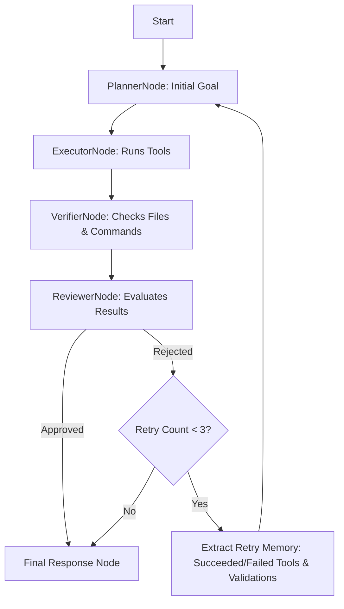

# Retry Behavior Analysis & Planner Retry Memory

This document analyzes the planner's retry/replanning behavior in `nakama_kun`, tracing why previous retries repeated prior failed actions instead of adapting to feedback. It also details the design and implementation of the **Retry Memory** system.

---

## Part 1: Tracing and Analysis

### 1. Planner Retry Logic
The orchestrator graph is structured using LangGraph (defined in [workflow.py](file:///home/tankaizokuo/Code/TanClaw/src/nakama_kun/orchestration/workflow.py)):
- **Graph Nodes**: `planner` -> `executor` -> `verifier` -> `reviewer` -> conditional edge.
- **Conditional Routing**: The `route_after_review` function evaluates the state after the Reviewer Node finishes:
  - If `reviewer_feedback` is `None`, it routes to the `final_response` node (successful completion).
  - If `reviewer_feedback` is present, it checks if `retry_count` is less than 3. If so, it routes back to `planner` (creating a loop).
- **Planner Node**: The planner node `planner_node` (defined in [nodes.py](file:///home/tankaizokuo/Code/TanClaw/src/nakama_kun/orchestration/nodes.py)) receives the state:
  - If `reviewer_feedback` is present, it constructs a prompt containing the feedback and increments `retry_count`.
  - It then calls `PlannerService.plan(prompt)`.

### 2. How Reviewer Feedback is Stored
The Reviewer Node evaluates task execution outputs. If it decides to reject:
- It returns `{"reviewer_feedback": content, "status": "planning", "messages": [...]}`.
- LangGraph merges this dictionary back into the central `AgentState` under the `reviewer_feedback` key.

### 3. How Feedback Reaches Replanning
During a retry, `planner_node` is invoked with the updated `AgentState`. It detects the feedback via:
```python
feedback = state["reviewer_feedback"]
```
If `feedback` is truthy, it builds a prompt containing the feedback and sends it to `PlannerService.plan(prompt)`, which forwards it to the LLM.

### 4. Why Retries Are Not Adapting
Before implementing Retry Memory, the planner failed to adapt and repeated the same actions because:
1. **Lack of Tool Execution Details**: The planner was never given the list of tool runs (`tool_results`). It didn't know which tools were executed, what arguments were used, or whether they succeeded or failed.
2. **Lack of Validation Failures**: Although the Verifier Node collects file existence details, exit codes, and test summaries into `verification_report`, this structured data was only passed to the Reviewer Node. The Planner Node did not receive the `verification_report`, leaving it unaware of exactly which files were missing or which validation commands/tests failed.
3. **Imprecise Feedback**: Reviewer feedback (e.g. LLM-generated text) might be high-level or miss specific technical details (like the exact path or content error). Without the underlying physical facts (like a specific test output or missing file on disk), the planner had to guess what actually went wrong.

---

## Part 2: Retry Memory Design

To solve the lack of context during replanning, we introduce **Retry Memory** inside `planner_node`. Before generating a new plan, the planner is supplied with a structured representation of the execution context:



The planner receives:
1. **Completed Actions**: A list of all successfully executed tool calls and their arguments.
2. **Previous Failures**: A list of all failed tool calls, their arguments, and their error/output snippets.
3. **Failed Validations**: A list of all missing artifacts, failed validation commands, and test failures extracted from the `verification_report`.
4. **Reviewer Comments**: The text feedback from the reviewer.

### Structured Retry Prompt Structure
On retry, the prompt template will be formatted as follows:

```markdown
Original Goal: {goal}

We previously attempted this, but the task was not fully successful and requires a revised plan.

### Reviewer Feedback
{reviewer_feedback}

### Completed Actions
- Tool 'write_file' succeeded with args: {"path": "result.py", "content": "x = 42"}

### Previous Failures
- Tool 'run_command' failed with args: {"cmd": "pytest"}
  Output/Error: pytest command not found...

### Failed Validations
- Expected file artifact does not exist: /workspace/result.py
- Command failed: 'pytest' (Exit code: 127)
```
Using this memory, the planner can identify exactly which tools failed, which verification checks were not met, and what needs to be changed in the revised plan to achieve success.

---

## Part 3: Token and Prompt Optimization

To prevent the prompt from growing excessively large and exceeding LLM context windows during multiple retries, the following design constraints are enforced:
- **Output Snippet Truncation**: Output/Error snippets for failed tool runs are truncated to `200` characters.
- **Command Output Truncation**: Stdout/stderr output from verification command results are capped at `200` characters.
- **Deduplication**: Artifact check warnings and existence check warnings are deduplicated by target file path.
