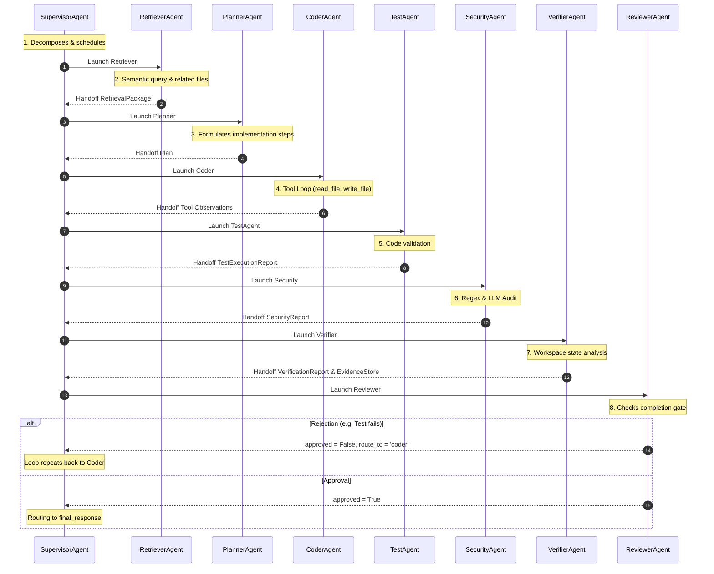

# Nakama-kun Multi-Agent System Documentation

Nakama-kun coordinates work using a crew of specialized sub-agents. This document describes the architecture, inputs, outputs, and transitions of each agent, matching the source code implementations.

---

## 1. Sub-Agent Directory

| Agent Class | Module Path | Graph Node name | Role | Primary Responsibility |
| :--- | :--- | :--- | :--- | :--- |
| **SupervisorAgent** | [supervisor.py](file:///home/tankaizokuo/Code/Nakama-Kun/src/nakama_kun/agents/supervisor.py) | `supervisor_agent_node` | `supervisor` | Dynamically decomposes user tasks and schedules other agents. |
| **PlannerAgent** | [planner.py](file:///home/tankaizokuo/Code/Nakama-Kun/src/nakama_kun/agents/planner.py) | `planner_agent_node` | `planner` | Formulates plans, incorporating RAG context and memory. |
| **RetrieverAgent** | [retriever.py](file:///home/tankaizokuo/Code/Nakama-Kun/src/nakama_kun/agents/retriever.py) | `retriever_agent_node` | `retriever` | Gathers context, performs codebase searches, and queries dependencies. |
| **CoderAgent** | [coder.py](file:///home/tankaizokuo/Code/Nakama-Kun/src/nakama_kun/agents/coder.py) | `coder_agent_node` | `coder` | Runs the workspace tool-execution loop to apply proposed edits. |
| **TestAgent** | [test_agent.py](file:///home/tankaizokuo/Code/Nakama-Kun/src/nakama_kun/agents/test_agent.py) | `test_agent_node` | `tester` | Generates, runs, and repairs tests (`pytest`). |
| **SecurityAgent** | [security.py](file:///home/tankaizokuo/Code/Nakama-Kun/src/nakama_kun/agents/security.py) | `security_agent_node` | `security` | Audits credentials, unsafe shell commands, and packages. |
| **VerifierAgent** | [verifier.py](file:///home/tankaizokuo/Code/Nakama-Kun/src/nakama_kun/agents/verifier.py) | `verifier_agent_node` | `verifier` | Compiles disk facts into structured `VerificationReport`s. |
| **ReviewerAgent** | [reviewer.py](file:///home/tankaizokuo/Code/Nakama-Kun/src/nakama_kun/agents/reviewer.py) | `reviewer_agent_node` | `reviewer` | Evaluates outcomes, verifies completion, and handles rejections. |

---

## 2. Agent Execution Sequences

Each node represents an agent wrapped in an orchestration factory. When executed, they accept `AgentState` and return a dictionary of state modifications:

---

## 3. Sub-Agent Specifications

### A. SupervisorAgent
- **Responsibility**: Dynamically schedules the execution queue of specialized agents and builds task delegation metrics (utilization, failure rates, latencies).
- **Inputs**: `goal`, `agent_history`, `agent_metrics`, `retrieval_package`, `coder_proposals`, `test_report`, `security_report`, `verification_report`, `reviewer_feedback`, `supervisor_telemetry`.
- **Outputs**:
  - `status`: "executing" or "done" (delegating to `final_response`).
  - `delegations`: List of `TaskDelegation` models.
  - `supervisor_telemetry`: Updated running latencies and failure distributions.
- **Fail-Safe / Fallback**: Sequential fallback scheduling matches classic linear pipelines (`RetrieverAgent` -> `CoderAgent` -> `TestAgent` -> `SecurityAgent` -> `VerifierAgent` -> `ReviewerAgent`).

### B. PlannerAgent
- **Responsibility**: Generates detailed, structured plans incorporating codebase RAG summaries and semantic memory insights.
- **Inputs**: `goal`, `reviewer_feedback`, `retry_count`, `tool_results` (to build `completed_actions` and `failed_actions`), and `verification_report` (to check `failed_validations`).
- **Outputs**:
  - `plan`: A structured `Plan` object containing a `goal_summary`, `targets`, `assumptions`, `ordered_steps`, `risks`, and a `validation_checklist`.
  - `required_artifacts`: Filenames derived from target checklist outputs.
  - `missing_artifacts`: Calculated paths not yet created.

### C. RetrieverAgent
- **Responsibility**: Gathers source context and runs dependency path lookups (`find_related_files`).
- **Inputs**: `goal`, `workspace_context`.
- **Outputs**:
  - `retrieval_package`: A structured `RetrievalPackage` containing `retrieved_files`, `summaries`, `citations`, and `relevance_scores`.
  - `relevant_files`: Paths selected for tool visibility.
  - `documentation`: Raw text snippets loaded into prompt context.

### D. CoderAgent
- **Responsibility**: Runs the main tool-calling execution loop to implement changes and verify plans.
- **Inputs**: `goal`, `plan`, `messages`, `tool_results`, `required_artifacts`, `created_artifacts`, `research_budget_remaining`, `delivery_mode`, `retry_memory`.
- **Outputs**:
  - `messages`: Appends tool call schemas and raw returns.
  - `tool_results`: List of executed actions.
  - `created_artifacts`: File paths modified during tool runs.
  - `delivery_mode`: Forced true if research budgets or round limits are exceeded.

### E. TestAgent
- **Responsibility**: Drafts unit test suites, runs test executors, and implements repair loops to resolve bugs.
- **Inputs**: `goal`, `created_artifacts`, `messages`.
- **Outputs**:
  - `test_report`: A structured `TestExecutionReport` containing counts of `passed`, `failed`, `skipped`, `errors`, and `recommendations`.
  - `tool_results`: List of executed test commands.

### F. SecurityAgent
- **Responsibility**: Deterministic scans and LLM audits to enforce credential containment and command safety.
- **Inputs**: `goal`, `coder_proposals`, `created_artifacts`, `tool_results`.
- **Outputs**:
  - `security_report`: A structured `SecurityReport` listing `warnings`, `vulnerabilities`, `blocked_actions`, and `remediation_suggestions`.

### G. VerifierAgent
- **Responsibility**: Analyzes the disk state and generates structured reports and evidence stores.
- **Inputs**: `goal`, `tool_results`, `required_artifacts`, `created_artifacts`.
- **Outputs**:
  - `verification_report`: Compiled disk facts (`files_created`, `files_modified`, `existence_checks`, `command_results`).
  - `evidence_store`: Aggregated historical tool runs and validations.

### H. ReviewerAgent
- **Responsibility**: Serves as the final gate check to evaluate outcomes and route rejections.
- **Inputs**: `goal`, `plan`, `verification_report`, `security_report`, `missing_artifacts`, `task_type`, `goal_satisfied`.
- **Outputs**:
  - `reviewer_feedback`: Detail of rejection reasons, or `None` if approved.
  - `reviewer_route`: String routing rejections to `coder` (bugs/compilation failures) or `planner` (structural misalignment).
  - `status`: "done" (passes gate) or "planning" (fails gate, trigger retry).
