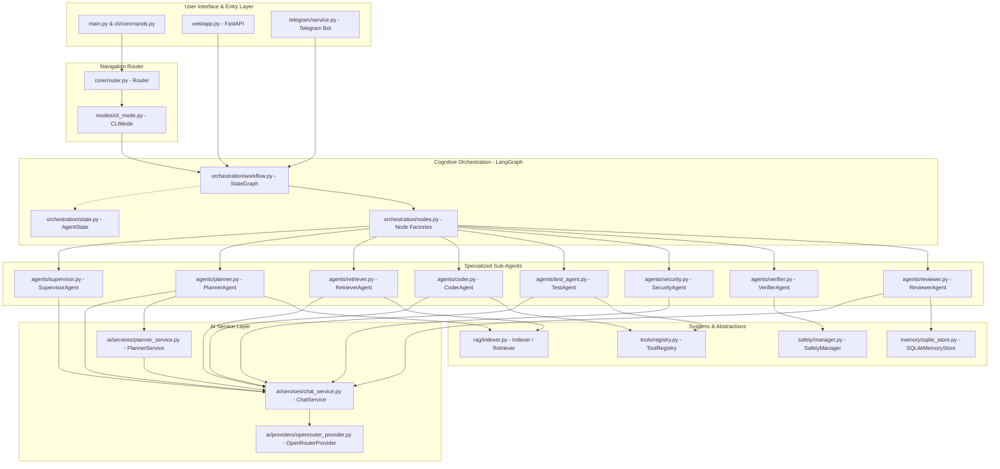
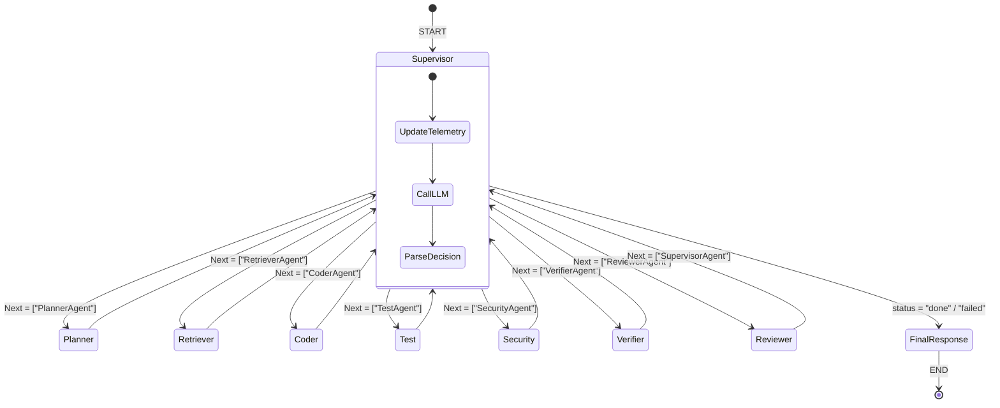

# Nakama-kun Architectural Design

This document details the software architecture, component relationships, state flow, and runtime execution sequences of **Nakama-kun**. Every definition and pathway here is derived directly from the source code.

---

## 1. High-Level Architecture Overview

Nakama-kun is built on a clean, decoupled, layered design that separates input interfaces (CLI, Telegram, Web UI) from the cognitive/coordinating agent logic (LangGraph, specialized agents) and the underlying platform abstractions (AI Provider, Tools, Vector RAG database, Experience SQLite persistence).

---

## 2. Dependency Graph and Layered Abstraction

Nakama-kun follows a strict layered architecture to prevent circular dependencies and maintain clean boundaries:

1. **Presentation Layer (`cli/`, `telegram/`, `web/`, `modes/`)**: Resolves system state, reads console inputs, handles WebSocket events, and routes to appropriate cognitive actions.
2. **Core/Navigation Layer (`core/`)**: Connects presentation entrypoints to leaf states via the navigation [Router](file:///home/tankaizokuo/Code/Nakama-Kun/src/nakama_kun/core/router.py).
3. **Orchestration Layer (`orchestration/`)**: Compiles the [StateGraph](file:///home/tankaizokuo/Code/Nakama-Kun/src/nakama_kun/orchestration/workflow.py) defining nodes, control transitions, and coordinates task execution.
4. **Agent Layer (`agents/`)**: Specialized sub-agents implementing domain logic (coding, safety audits, plan refinements, validation checks).
5. **AI Integration Layer (`ai/`)**: Declares standard provider contracts (`interfaces.py`), implements target endpoints (`OpenRouterProvider`), and encapsulates chat message compilation.
6. **Infrastructure Layer (`rag/`, `memory/`, `safety/`, `tools/`)**: Lower-level primitives supplying filesystem access, vector storage, human-in-the-loop validation, and SQL database read/write.

---

## 3. Cognitive Workflow: The LangGraph State Machine

The cognitive backbone of Nakama-kun is a state machine compiled using LangGraph. The workflow coordinates sequential, parallel, and feedback-loop control paths.

### State Management: `AgentState` Schema
The central repository of data propagated across nodes is defined by `AgentState` (in [state.py](file:///home/tankaizokuo/Code/Nakama-Kun/src/nakama_kun/orchestration/state.py)):
- **Messages Accumulator**: `messages: Annotated[list[Message], operator.add]` tracks all conversational histories.
- **Tool Results Log**: `tool_results: Annotated[list[dict[str, Any]], operator.add]` aggregates output, errors, and run parameters.
- **Artifact Management**: `required_artifacts` (the defined list of deliverables), `created_artifacts` (paths modified on disk), and `missing_artifacts` (unwritten required paths).
- **Physical Verification**: `verification_report` containing disk validation facts and `evidence_store` containing structured execution artifacts.
- **Planner Retry Memory**: `retry_memory` maps failures, rejections, and previous attempts to avoid loops.
- **Routing & Status**: `status` (planning, executing, reviewing, done, failed), `active_agent`, `agent_outputs`, `agent_metrics`, and `reviewer_route` (rejection target routing: `coder` or `planner`).

---

## 4. Service Layer and Provider Abstraction

Loose coupling between LLM APIs and Nakama-kun is maintained via `BaseProvider` in [base_provider.py](file:///home/tankaizokuo/Code/Nakama-Kun/src/nakama_kun/ai/providers/base_provider.py):

- **Abstractions**: All agents consume `ChatService` which invokes `BaseProvider.generate()` or `BaseProvider.generate_stream()`.
- **Implementation**: `OpenRouterProvider` interacts with OpenAI APIs (refer to [openrouter_provider.py](file:///home/tankaizokuo/Code/Nakama-Kun/src/nakama_kun/ai/providers/openrouter_provider.py)). It maps friendly configuration keys (e.g. `gpt5`, `claude`, `r1`) to active endpoint URLs.
- **Telemetry Hooking**: `ChatService` wraps calls with Loguru logging, capturing request latencies, total tokens used, input roles, and raw response strings for central audits.

---

## 5. Dependency Injection Approach

Dependency injection (DI) in Nakama-kun is structured programmatically via constructor injection. This guarantees that all components remain fully unit-testable without relying on global framework containers:

1. **Console DI**: Mode classes require `Console` injection or default to the global console helper.
2. **AI DI**: Services accept provider interfaces (`ChatService(provider)`). Agents accept service interfaces (`PlannerAgent(chat_service)`).
3. **Workspace context mapping**: RAG vector store and indexers resolve settings via Pydantic classes and read relative paths based on injected workspace roots.
4. **Web wiring**: In [service_wiring.py](file:///home/tankaizokuo/Code/Nakama-Kun/src/nakama_kun/web/service_wiring.py), the global `WebServiceContext` resolves and wires providers, safety managers, and the customized WebSocket approval provider.
