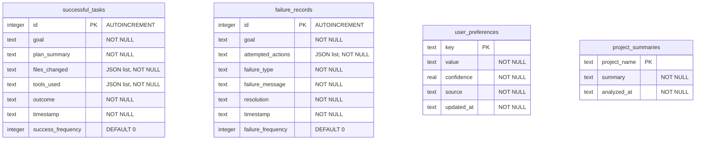
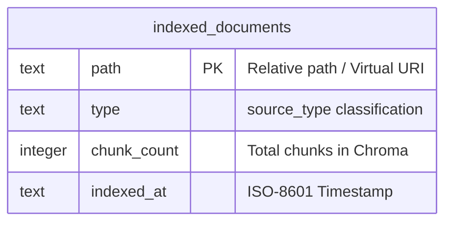

# SQLite Database Schema and Persistence Layout

Nakama-kun uses two local SQLite databases: one for coordinating experience memory, and one for tracking RAG document syncing.

---

## 1. Experience Database: `nakama_memory.db`

Coordinates successes, failures, and configurations across planning iterations.

### Table Definitions

#### A. `successful_tasks`
Stores metadata and outcomes of verified, QA-approved tasks:
- `files_changed`: JSON list of files written or updated (e.g. `["src/main.py", "tests/test_main.py"]`).
- `tools_used`: JSON list of unique tools executed during the run.
- `success_frequency`: Running counter incremented when similar goals match successfully.

#### B. `failure_records`
Logs failed task iterations rejected by QA:
- `attempted_actions`: JSON array of action sequences that failed (e.g. `["write_file({\"path\": \"...\", ...})", ...]`).
- `failure_type`: Classified categorization (`MISSING_ARTIFACTS`, `TEST_FAILURE`, `QA_REJECTION`).
- `failure_message`: Standard output exception or QA comments.
- `resolution`: Target actions or routing decisions.

#### C. `user_preferences`
Key-value preferences persisted across launches:
- `confidence`: Confidence score (`0.0` to `1.0`) of the preferred configuration.
- `source`: Extraction source (`user_input`, `analysis`).

---

## 2. Document Tracker Database: `.rag/documents.db`

Manages change synchronization and invalidation for RAG vector DB chunks.

### Table Definitions

#### A. `indexed_documents`
Tracks indexed files and virtual resources:
- `path`: Key matching the filesystem path (e.g. `src/nakama_kun/main.py`) or virtual memory URIs (e.g. `memory://successful_tasks/1`).
- `type`: Classified type (`python_source`, `test`, `readme`, `documentation`, `markdown`, `architectural_summary`, `workspace_summary`, `retry_memory`, `verification_report`, `evidence_store`).
- `chunk_count`: Sync metadata count indicating how many vectors are stored inside Chroma for this document. Used to clean out-of-date vector chunks during incremental updates.
