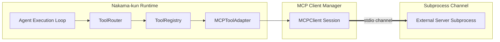
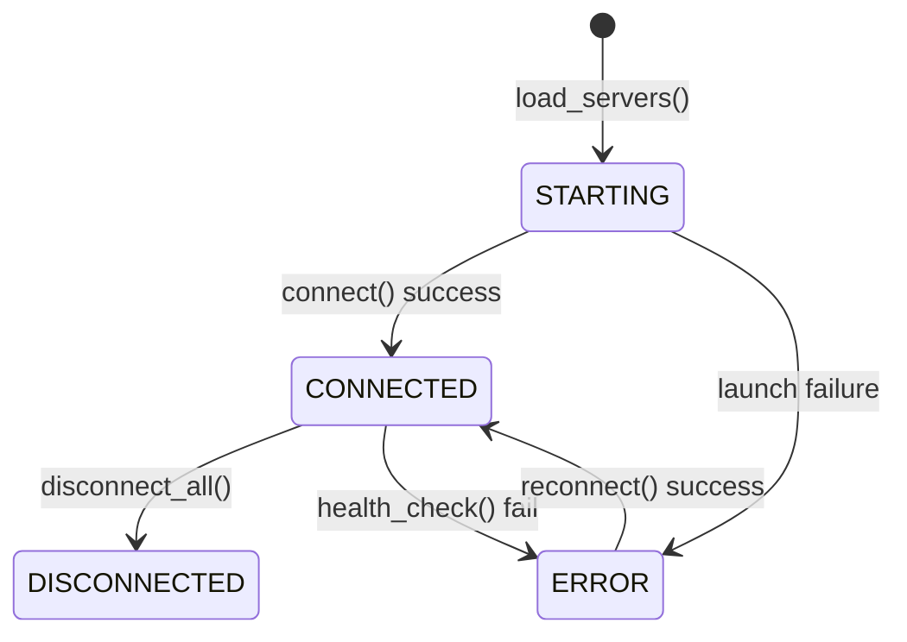
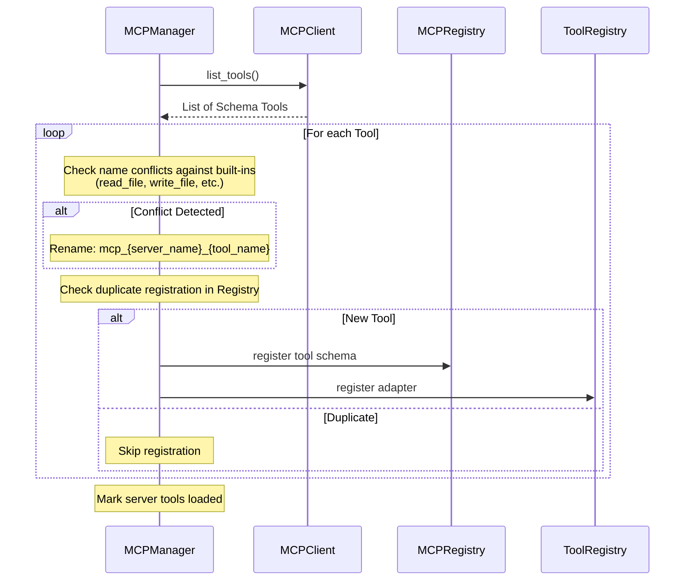

# Model Context Protocol (MCP) Integration

Nakama-kun implements a client wrapper for the **Model Context Protocol (MCP)**, allowing the agentic loop to connect to external systems (e.g. databases, browsers, github) and dynamically expose their capabilities as agent tools.

---

## 1. MCP Client Architecture

MCP servers run as separate subprocesses communicating with Nakama-kun over stdin/stdout channels using JSON-RPC protocols:

---

## 2. Server Configuration and Lifecycle

Server definitions are configured in `mcp_config.json` or `mcp.yaml` and loaded via [MCPSettings](file:///home/tankaizokuo/Code/Nakama-Kun/src/nakama_kun/config/mcp.py). The server connection status is tracked using the `MCPServerStatus` enum (STARTING, CONNECTED, DISCONNECTED, ERROR).

- **Starting**: Registry allocates `MCPServer` in `STARTING` state, initializing stdio subprocess pipes.
- **Connection Recovery**: Startup is non-blocking. If a server fails to launch, the manager logs the error and continues to load other servers.

---

## 3. Tool Discovery and Namespace Registration

Namespace registration is managed by [MCPManager](file:///home/tankaizokuo/Code/Nakama-Kun/src/nakama_kun/mcp/manager.py):

- **Namespace Conflict Resolution**: If an MCP tool shares a name with a built-in workspace tool (e.g. `write_file`), the manager renames it to `mcp_<server_name>_<original_name>` to prevent conflicts.
- **Idempotence**: A tracking set `_tools_loaded` prevents duplicate registrations.

---

## 4. Health Checks and Connection Maintenance

Health checks run via `health_check()` inside the manager:
- Periodically queries `list_tools()` on active client sessions.
- If a session hangs or raises exceptions, the server status transitions to `ERROR`.
- During agent execution rounds, if an adapted MCP tool is invoked and returns errors due to session timeouts, the manager attempts reconnection.
