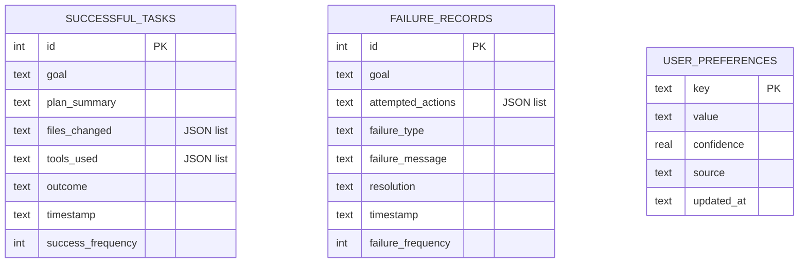

# Nakama-kun Memory and Experience Persistence System

Nakama-kun integrates a local, persistent memory system. It captures successes, failures, and user choices from previous tasks, feeding them back into the Planner Agent's context to guide future decisions.

---

## 1. Persistence Layer Architecture

Memory is backed by a local SQLite database (`nakama_memory.db`) managed via `SQLiteMemoryStore` (refer to [sqlite_store.py](file:///home/tankaizokuo/Code/Nakama-Kun/src/nakama_kun/memory/sqlite_store.py)):

---

## 2. Session and Long-Term Memory Lifecycle

1. **Short-Term/Session Memory**: Tracks conversation message nodes inside `AgentState.messages`. When running REPL modes (Ask, Plan), previous conversation messages are fetched and appended to pre-warm the LLM context.
2. **Experience Logging**:
   - **On Approval**: If the `ReviewerAgent` approves the task, `MemoryManager.save_successful_task()` writes the goal, plan summary, tool history, and changed files to the database.
   - **On Rejection**: If the Reviewer rejects the task (e.g. missing artifacts, test failures), the manager saves a `FailureRecord` detailing the attempts, failure type, resolution strategy, and counts.
3. **User Preferences**: Dynamic keys extracted or specified by the user.

---

## 3. Experience Injection in Planning

When the `PlannerAgent` decomposes a new goal:
1. **Semantic Querying**: The `ExperienceRetriever` matches the user's current goal against the stored SQLite successes and failures (refer to [planner.py](file:///home/tankaizokuo/Code/Nakama-Kun/src/nakama_kun/agents/planner.py)).
2. **Context Compilation**:
   - Matches are processed by `ExperienceAwarePlanner` to format a `Past Experiences` prompt context block.
   - It lists successful plans that solved similar goals.
   - It builds a **Failure Prevention Guidance** checklist indicating similar attempts that failed, their error messages, and what resolutions worked.
3. **LLM Conditioning**: The prompt is appended to the system prompt of the `PlannerAgent`, allowing it to reuse successful patterns and avoid repeating past failure strategies.
