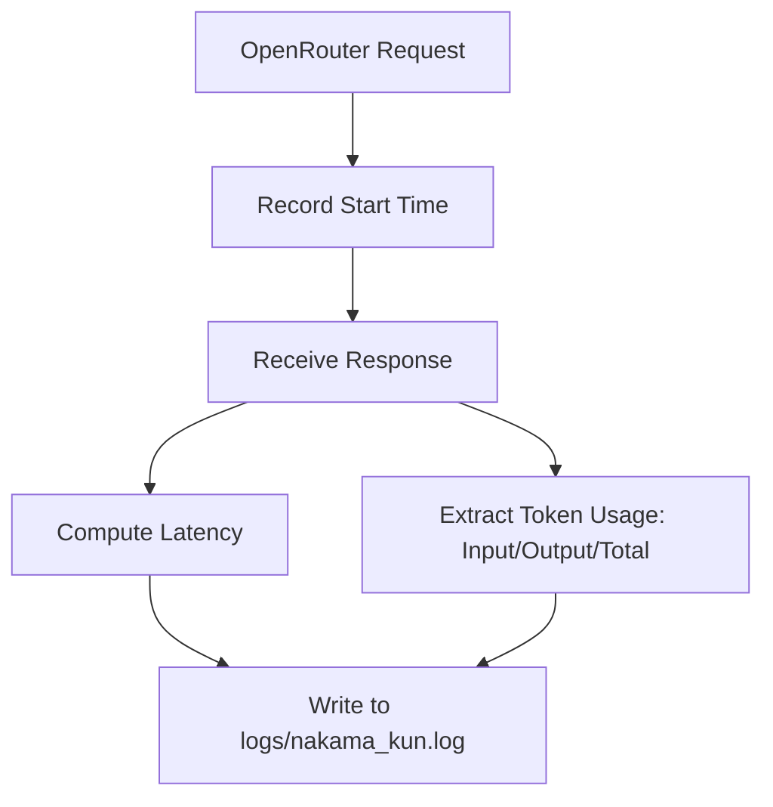

# Observability, Metrics, and Telemetry

Nakama-kun implements a logging and telemetry architecture to track LLM response latency, tokens spent, sub-agent latency, node failures, and safety exceptions.

---

## 1. Logging Infrastructure

- **Library**: `loguru`
- **Output Destination**:
  - **Console**: Structured output styled with Rich formatting for human-in-the-loop alerts.
  - **File**: Detailed debug records written to `logs/nakama_kun.log` (rotation and compression configured).
- **Log Levels**:
  - `INFO`: Lifecycle milestones (e.g. server connections, agent nodes starting, RAG database updates).
  - `WARNING`: Recoverable errors (e.g. LLM API call retries, tool failures, duplicated actions blocked).
  - `ERROR`: Safety exceptions, path escape traps, database transaction locks, connection failures.

---

## 2. Metrics Collection



### A. Provider Telemetry
Managed inside `ChatService` (refer to [chat_service.py](file:///home/tankaizokuo/Code/Nakama-Kun/src/nakama_kun/ai/services/chat_service.py)):
- **Latency**: Measures roundtrip generation time in seconds.
- **Token Tracking**: Logs exact token usage counts:
  - `prompt_tokens`: Tokens sent in the system/user payload.
  - `completion_tokens`: Output length.
  - `total_tokens`: Total usage cost.

### B. Sub-Agent Execution Metrics
Managed inside `BaseAgent.run()` (refer to [base.py](file:///home/tankaizokuo/Code/Nakama-Kun/src/nakama_kun/agents/base.py)):
- Tracks agent execution durations:
  ```python
  metrics[self.name] = {
      "duration_seconds": duration,
      "status": updates.get("status") or state.get("status"),
  }
  ```
- These metrics accumulate in `AgentState.agent_metrics` across the LangGraph execution.

### C. Supervisor Telemetry
Managed inside `SupervisorAgent.plan()` (refer to [supervisor.py](file:///home/tankaizokuo/Code/Nakama-Kun/src/nakama_kun/agents/supervisor.py)):
- Rebuilds running execution statistics on every cycle:
  - **`agent_utilization`**: Count of node invocations per agent.
  - **`task_latency`**: Array of latency durations recorded by each node execution.
  - **`failure_rates`**: Calculations of failure frequency (e.g. QA rejections, test failures) per agent.

---

## 3. Debugging Workflow

1. **CLI Debug Mode**: Execute Typer commands with the `--debug` parameter to print full stack trace dumps rather than truncated error summaries.
2. **WebSocket Logs**: Web mode routes runtime agent logs (`🔧 Executed tool: ... | Success: ...`) to connected UI WebSocket channels in real time.
3. **Evidence Auditing**: The `EvidenceStore` captures and persists standard outputs, validation command exit codes, and diff structures. In case of unexpected agent failures, developers can query `nakama_memory.db` to inspect the failure logs and attempted action history.
