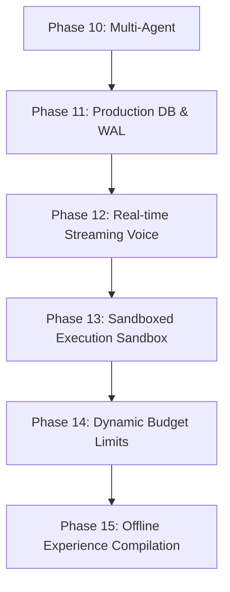

# Nakama-kun Project Roadmap

This document outlines the development history, current architecture status, existing technical debt, and future milestones for the Nakama-kun terminal companion framework.

---

## 1. Project Lifecycle & Milestone Status

Nakama-kun has evolved from a simple terminal-based REPL to a comprehensive, multi-agent cooperative workspace assistant with local retrieval, memory tracing, and multi-interface support.

### Completed Milestones (Phases 1-10)

| Phase | Milestone | Status | Key Deliverables & Features |
| :--- | :--- | :--- | :--- |
| **Phase 1** | **CLI Foundation & UI** | **Completed** | Typer CLI commands, ASCII branding via `rich`, and interactive `questionary` navigation menu. |
| **Phase 2** | **Multi-Mode Router** | **Completed** | Centralized `Router` and abstract `BaseMode` managing transition states (BACK, EXIT, SWITCH). |
| **Phase 3** | **AI Integration Layer** | **Completed** | Decoupled `LLMProvider` (OpenRouter/AsyncOpenAI), stream renderers, and model registry mapping. |
| **Phase 4** | **Tool Calling Framework** | **Completed** | Registry and router for filesystem operations (`read`, `write`, `search`) and shell execution (`run_command`), guarded by workspace constraint checks. |
| **Phase 5** | **Planning Agent** | **Completed** | Structured plans (`Plan` model) and interactive planning REPL enabling manual validation checklist editing. |
| **Phase 6** | **Workspace Awareness** | **Completed** | AST parsers generating file dependency digraphs (`networkx`) and Change Impact analysis via BFS traversal. |
| **Phase 7** | **Telegram Integration** | **Completed** | Async Telegram Bot mapping CLI prompts to remote interactive chat loops. |
| **Phase 8** | **Memory & Experience** | **Completed** | Local `SQLite` persistence of task metrics, success frequency, past failure-resolution history, and semantic planning injections. |
| **Phase 9** | **RAG Pipeline** | **Completed** | Incremental sync tracker (`indexed_documents`), BGE-M3/ONNX embeddings, and token-budget Context Assembler. |
| **Phase 10** | **Multi-Agent Orchestration** | **Completed** | LangGraph-coordinated workflow executing specialized agents (Supervisor, Planner, Retriever, Coder, Test, Security, Verifier, Reviewer, Final Response) with full state telemetry. |

---

## 2. Technical Debt & Current Limitations

While Phase 10 delivers a powerful local development assistant, the codebase has several bottlenecks and stubs that should be addressed before production deployment:

### A. SQLite Concurrent Write Limitations
* **Description**: `nakama_memory.db` and `.rag/documents.db` use standard SQLite connections. When parallel agents or sub-processes trigger workspace reads, writes, or evaluations simultaneously, database locks can occur.
* **Impact**: Risk of `sqlite3.OperationalError: database is locked` exceptions during highly parallel tasks.
* **Mitigation Plan**: Introduce WAL (Write-Ahead Logging) mode and implement a serialized connection pool or task queue for database access.

### B. Voice Mode & Media Stubs
* **Description**: The voice interface includes baseline STT (Whisper) and TTS (ElevenLabs) integrations, but relies on blocking sound playback/recording calls and stub/mock configurations in unsupported test environments.
* **Impact**: High-latency speech synthesis; non-async UI freezes during recording.
* **Mitigation Plan**: Refactor `voice_mode.py` to use asynchronous stream processing and regional audio chunk buffering.

### C. Large-Context Rate Limiting & Tokens Spent
* **Description**: Detailed multi-agent telemetry and planning history sent to OpenRouter can easily exceed tokens-per-minute limits of cost-effective models.
* **Impact**: HTTP 429 errors from provider.
* **Mitigation Plan**: Implement exponential backoff, rate-limit queueing, and smart context truncation (summarizing old steps).

### D. Security Verification Capabilities
* **Description**: `SecurityAgent` performs static analysis and checks command blocklists, but cannot fully simulate code runtime execution in a secure sandbox.
* **Impact**: Malicious code patterns or recursive loops might pass checks if they bypass simple regex rules.
* **Mitigation Plan**: Integrate containerized execution (e.g. Docker sandboxes) for running test validation commands.

---

## 3. Future Roadmap (Phases 11-15)

### Phase 11: Production Database Scaling & WAL Activation
* Migrate SQLite databases to WAL mode by default with auto-checkpoints.
* Abstract the storage layer to support PostgreSQL, enabling shared agent history/memory databases in multi-developer environments.
* Implement structured schema migration tooling (e.g., Alembic).

### Phase 12: Real-time Streaming Voice & Low-Latency Audio
* Migrate Whisper STT and ElevenLabs TTS to WebSockets-based streaming API integrations.
* Enable voice interruption: agents should stop generating speech immediately if the user speaks during output playback.
* Standardize headless audio capture for Linux/macOS.

### Phase 13: Browser Automation & Desktop Integration
* Introduce browser automation tools (via Playwright) allowing Nakama-kun to interact with web interfaces, authenticate with local dev servers, and audit generated frontend assets.
* Build a local tray application/widget displaying agent states, task queues, and human-in-the-loop approvals.

### Phase 14: Dynamic Budget & Planning Constraints
* Add token/cost constraints to the `SupervisorAgent` planner. Users will be able to set a hard limit (e.g., "Do not exceed $1.00 or 50k tokens on this goal").
* Implement dynamic sub-agent pruning: if a task is simple, bypass Coder/Verifier iterations and respond instantly.

### Phase 15: Offline Experience Compilation & Self-Refining Loops
* Train a small local model (e.g., Llama-3-8B-Instruct or Qwen-2.5-Coder) using the compiled `nakama_memory.db` logs.
* Implement automated regression sweeps: the agent generates, tests, and evaluates patches against a test suite in the background, updating its local memory of optimal code structures.
