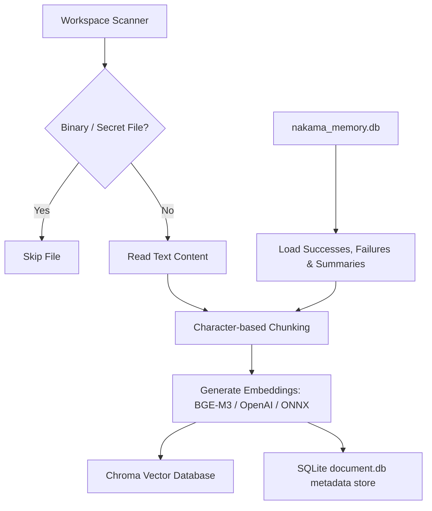
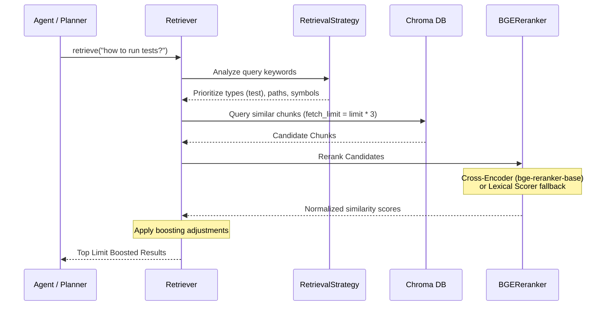

# Retrieval-Augmented Generation (RAG) System

Nakama-kun features a localized RAG system that indexes workspace files, architectural definitions, and SQLite-persisted experience logs, making them searchable via semantic vector queries.

---

## 1. RAG Indexing Pipeline

The indexing pipeline is coordinated by [Indexer](file:///home/tankaizokuo/Code/Nakama-Kun/src/nakama_kun/rag/indexer.py):

### Chunking strategy
- Text is split into chunks of **800 to 1,200 characters** with an overlap of **100 to 200 characters** (refer to `chunk_text` in [indexer.py](file:///home/tankaizokuo/Code/Nakama-Kun/src/nakama_kun/rag/indexer.py)).
- **Section & Heading Alignment**: If the parser identifies a Markdown heading (`#`, `##`, `###`), it flushes the active chunk buffer early to keep sections coherent.
- **Symbol Extraction**: The chunker uses regular expressions to detect class and function definitions (e.g. `def `, `class `) within Python files, appending them to the chunk's metadata.

---

## 2. Embedding and Vector Storage

### Embedding Providers
Nakama-kun implements a provider-agnostic `EmbeddingProvider` interface (refer to [embeddings.py](file:///home/tankaizokuo/Code/Nakama-Kun/src/nakama_kun/rag/embeddings.py)):
1. **BGE-M3 (Default)**: Dimension `1024`. Invokes `sentence-transformers` locally. Falls back to a deterministic MD5 hashing unit vectorizer if offline or missing dependencies.
2. **OpenAI**: Connects to the configured OpenAPI or OpenRouter embeddings endpoint (e.g. `text-embedding-3-small`).
3. **ONNX MiniLM**: Dimension `384`. Uses ONNX runtime for lightweight local tokenization.

### Vector Storage
- Backed by **ChromaDB** persistent storage (implemented in [vector_store.py](file:///home/tankaizokuo/Code/Nakama-Kun/src/nakama_kun/rag/vector_store.py)).
- Indexes document chunks along with metadata: `source_path`, `source_type` (file, test, readme, memory event), and `symbol_names`.

---

## 3. Retrieval Pipeline & Context Construction

When a query is dispatched to the [Retriever](file:///home/tankaizokuo/Code/Nakama-Kun/src/nakama_kun/rag/retriever.py):

### Retrieval Strategy & Boosting
The `RetrievalStrategy` class scans queries for keywords to dynamically adjust retrieval:
- **Test queries**: Boosts documents with `source_type == "test"` (+0.15) and prioritizes files matching test directories (+0.25).
- **Architecture / Explain queries**: Prioritizes `readme` and `documentation` files (+0.10).
- **Symbol queries**: Scans the workspace symbol index. If query terms match active symbols (functions/classes), the enclosing files are prioritized (+0.25).

### Cross-Encoder Reranking
Candidates are reranked using `BGEReranker`:
- **Cross-Encoder Model**: BAAI/bge-reranker-base predicts a match score between query and chunk.
- **Fallback Scorer**: Lexical term frequency overlap (TF-IDF approximation) combined with initial query ranks.

### Context Assembly
Before presenting retrieved information to the LLM, the `ContextAssembler` refines it:
- **De-duplication**: Filters out duplicate text blocks.
- **Adjacent Chunk Merging**: Combines contiguous line ranges in the same file into a single block to preserve readability.
- **Token Budget Gate**: Formats blocks as markdown code blocks with line citations, truncating content once the token limit (default `4000`) is reached.
