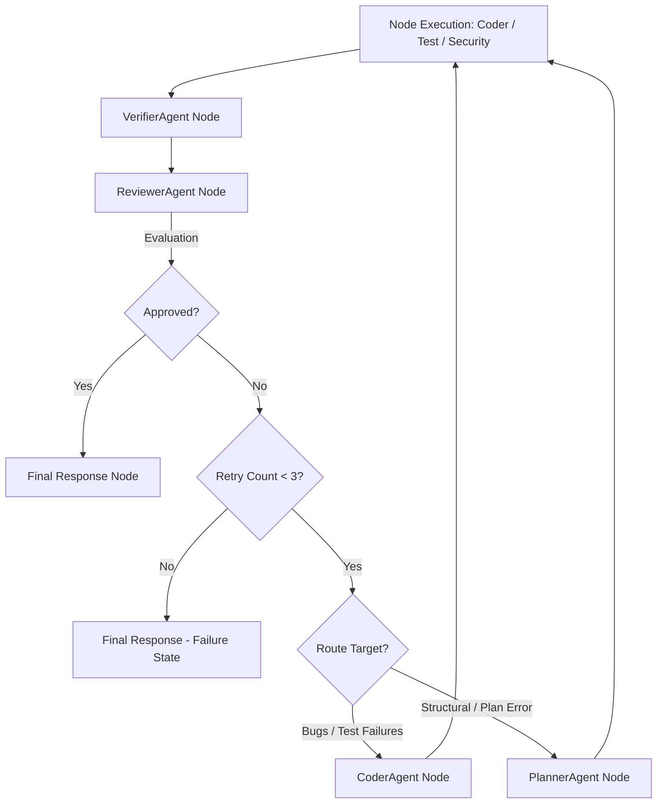

# Nakama-kun Retry and Replanning System

Nakama-kun implements a self-correcting feedback loop. When a task execution fails to meet quality standards, unit tests fail, or safety rules are violated, the system routes the state back through a planning or coding refinement cycle rather than aborting.

---

## 1. The Refinement Loop

The retry cycle is initiated by the [ReviewerAgent](file:///home/tankaizokuo/Code/Nakama-Kun/src/nakama_kun/agents/reviewer.py) and routed by conditional edges in the [StateGraph](file:///home/tankaizokuo/Code/Nakama-Kun/src/nakama_kun/orchestration/workflow.py):



---

## 2. Structured Retry Context: `RetryMemory`

During a retry, standard LLMs often repeat previous strategies if they do not know what went wrong. Nakama-kun solves this using a dedicated `RetryMemory` model stored in the state (refer to [state.py](file:///home/tankaizokuo/Code/Nakama-Kun/src/nakama_kun/orchestration/state.py)):

```python
class RetryMemory(TypedDict):
    completed_actions: list[str]
    failed_actions: list[str]
    failed_validations: list[str]
    reviewer_feedback: list[str]
    failed_attempt_signatures: list[str]
```

### Context preservation and formatting
When a transition to `planner` or `coder` is triggered on rejection:
1. `make_planner_agent_node` or `make_planner_node` scans all `tool_results` to extract:
   - **Completed Actions**: Tool invocations that succeeded, alongside their JSON arguments.
   - **Previous Failures**: Tool invocations that returned errors, including output/error snippets (truncated to `200` characters to optimize prompt budgets).
2. The node extracts **Failed Validations** by auditing the `verification_report`:
   - Expected required files that are missing.
   - Referenced files that do not exist.
   - Commands or unit tests that exited with non-zero codes, appending stdout/stderr snippet warnings (truncated to `200` characters).
3. The node generates a **Failed Attempt Signature** (e.g. `write_file:{"path": "result.py", "content": "x = 42"}`) for each failed tool execution.

This structured context is injected directly into the prompt on retry:

```markdown
We previously attempted this, but the task was not fully successful and requires a revised plan.

### Reviewer Feedback
[REJECTED]
Test suite failed: NameError: name 'utils' is not defined.

### Completed Actions
- Tool 'write_file' succeeded with args: {"path": "src/module.py", ...}

### Previous Failures
- Tool 'run_command' failed with args: {"cmd": "pytest"}
  Output/Error: ...NameError: name 'utils' is not defined...

### Failed Validations
- Test runner command failed: 'pytest' (Exit code: 1)
```

---

## 3. Duplicate Prevention: Action Signatures

To prevent the agent from looping on identical failing operations:
- The `CoderAgent` constructs an **Action Signature** for every proposed tool execution.
- If the signature exists in `failed_attempt_signatures` (passed via `RetryMemory`), the execution is blocked *before* dispatching.
- The agent receives a deterministic failure observation:
  `WARNING: This action already failed. Choose a different strategy.`
- This forces the LLM to choose a different approach, refactor content, or adjust imports.
