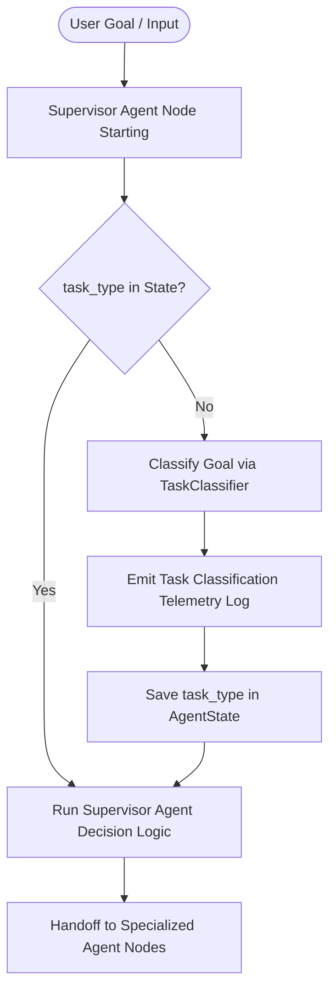

# Task Classification Architecture

The task classification layer defines a strongly-typed intent system that serves as a single source of truth for downstream orchestration and scheduling decisions.

## 1. Classification Architecture

The classification layer is designed with the following core components:

* **`TaskType` Enum**: Defines task intent categories. Inherits from `str` and `Enum` to enable native string serialization and case-insensitive string compatibility.
* **`ClassificationRule`**: Encapsulates matching logic using scoring weights and regular expressions with word boundary (`\b`) guards. This isolates patterns and prevents substring collision bugs (e.g., preventing "implementation" in "Explain implementation" from matching the code modification verb "implement").
* **`TaskClassifier`**: Orchestrates classification using rules and applies mixed request dominance logic. It emits telemetry logs and provides metadata (confidence and reason) to callers.

---

## 2. Classification Lifecycle

The task intent classification lifecycle runs as follows:



1. **Initial Trigger**: The user task is submitted to the LangGraph orchestration loop.
2. **First-pass Initialization**: The graph transitions from `START` to `supervisor_agent_node`.
3. **Classification Check**: The supervisor node checks if `task_type` is present in the `AgentState`. Since it is empty at startup, it executes `classify_task(goal)`.
4. **Telemetry Emission**: `TaskClassifier` writes a structured log of format:
   `[Task Classification] task_type=... reason=... confidence=...`
5. **Persistence**: The classification output is merged back into the graph's `AgentState` as `task_type`.
6. **Subsequent Nodes**: On subsequent iterations or nodes (Planner, Coder, Reviewer, etc.), the state already holds `task_type`, so they reuse the persisted value without re-classifying.

---

## 3. Extension Process for New Task Types

Adding new task types is designed to be frictionless, requiring no modifications to the workflow routing logic:

1. **Add Member to `TaskType`**:
   Add the new value to the `TaskType` enum in `src/nakama_kun/orchestration/task_classifier.py`:
   ```python
   class TaskType(str, Enum):
       # ...
       NEW_TASK_TYPE = "new_task_type"
   ```
2. **Define Classification Rules**:
   Add a corresponding `ClassificationRule` to the classifier inside `TaskClassifier.classify` (or define it in the rules list):
   ```python
   ClassificationRule(
       TaskType.NEW_TASK_TYPE,
       ["keyword1", "keyword2", "exact phrase"],
       weight=1.0
   )
   ```
3. **Verify via Tests**:
   Add classification tests in `tests/test_task_classification.py` to ensure the new task type resolves correctly and does not collide with existing rules.

---

## 4. Validation Examples

The task classifier has been validated across the following scenarios:

| Goal String | Resulting `TaskType` | Telemetry Reason & Confidence |
| :--- | :--- | :--- |
| **"Analyze repository"** | `analysis` | `Highest matching score (2.4) for analysis` (conf=0.60) |
| **"Generate README"** | `documentation` | `Highest matching score (1.5) for documentation` (conf=0.38) |
| **"Fix auth bug"** | `code_modification` | `Highest matching score (4.0) for code_modification` (conf=1.00) |
| **"Update README and implement feature X"** | `code_modification` | `Highest matching score (6.0) for code_modification` (conf=1.00) |
| **"Update README"** | `documentation` | `Highest matching score (1.5) for documentation` (conf=0.38) |
