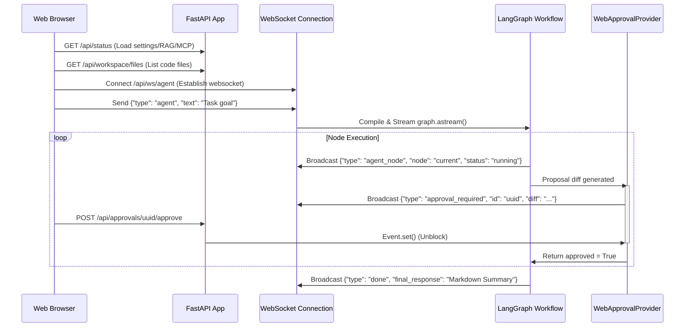

# Nakama-kun User Interface Architecture

Nakama-kun is built on a **multi-interface** design: a terminal-first command line interface (CLI) with interactive REPLs, a Telegram Bot, and a web-based graphical dashboard.

---

## 1. Interaction Topology

The navigation hierarchy is managed by the central [Router](file:///home/tankaizokuo/Code/Nakama-Kun/src/nakama_kun/core/router.py) and [CLIMode](file:///home/tankaizokuo/Code/Nakama-Kun/src/nakama_kun/modes/cli_mode.py) orchestrator:

```
                            [main.py Entry]
                                   │
                                   ├──► nakama_kun wakeup (Interactive TUI)
                                   │     │
                                   │     ├──► CLI Mode Orchestrator
                                   │     │     ├──► Ask Mode (Streaming REPL)
                                   │     │     ├──► Plan Mode (Planning REPL)
                                   │     │     ├──► Agent Mode (Orchestrator TUI)
                                   │     │     ├──► Explain Project (Markdown)
                                   │     │     └──► Memory Actions (SQLite Tables)
                                   │     │
                                   │     └──► Telegram Mode Bot Loop
                                   │
                                   ├──► nakama_kun web (FastAPI dashboard)
                                   └──► nakama_kun explain | list-directory | memory | rag
```

---

## 2. Terminal-First UI (TUI) Design

Nakama-kun's TUI is designed using a terminal visual style styled using [Rich](https://github.com/Textualize/rich) and [Questionary](https://github.com/tmbo/questionary).

### Shared Console visual language
Central colors and theme styling are defined in `src/nakama_kun/core/constants.py`:
- **Primary / Action**: Bright Cyan (`bright_cyan`)
- **Secondary / Accents**: Bright Magenta (`bright_magenta`)
- **Success / Positive**: Bright Green (`bright_green`)
- **Warning / Alert**: Yellow (`yellow`)
- **Error / Failure**: Bright Red (`bright_red`)

Interactive Questionary select menus use a custom style sheet defined in [menus.py](file:///home/tankaizokuo/Code/Nakama-Kun/src/nakama_kun/ui/menus.py):
- `pointer`: Bold magenta arrow (`❯`)
- `highlighted`: Magenta background selection
- `selected`: Green confirmation badge

### Mode Switching & Navigation
Modes inherit from `BaseMode` in [base.py](file:///home/tankaizokuo/Code/Nakama-Kun/src/nakama_kun/modes/base.py):
- Navigation intents are communicated back to the router using the `NavSignal` enum:
  - `NavSignal.CONTINUE`: Stay in active mode loop.
  - `NavSignal.BACK`: Return to parent/previous menu level.
  - `NavSignal.EXIT`: Clean terminate the entire application.

---

## 3. Web Dashboard Architecture (FastAPI & WebSockets)

Nakama-kun exposes a web graphical interface via a FastAPI server (`src/nakama_kun/web/app.py`).



### Key API Endpoints
- `GET /api/status`: Checks active LLM settings, registered tools, and MCP connections.
- `GET /api/workspace/files` / `file`: Exposes file browsing capabilities.
- `GET /api/memory/conversations` / `tasks`: Queries the SQLite memory repository.
- `POST /api/rag/build` / `refresh` / `clear`: Direct control of RAG index building.
- `GET /api/approvals/pending`: Lists current blocked modifications.
- `POST /api/approvals/{id}/approve` | `reject`: Responds to safety gates.

---

## 4. Telegram Bot Interface

Telegram Mode launches a polling bot defined in `src/nakama_kun/telegram/service.py` using `python-telegram-bot`. 

### Command Mapping
- `/start`: Shows initial greeting, active version, and model configurations.
- `/status`: Checks system workspace details, tools registered, and memory status.
- `/ask <query>`: Triggers ChatService to compute a quick answer.
- `/plan <goal>`: Runs the PlannerService and formats a structured Markdown plan.
- `/agent <task>`: Launches the autonomous LangGraph agent loop in the background and sends periodic updates.
- **Plain Text Message**: Routes to Ask Mode behavior by default.
