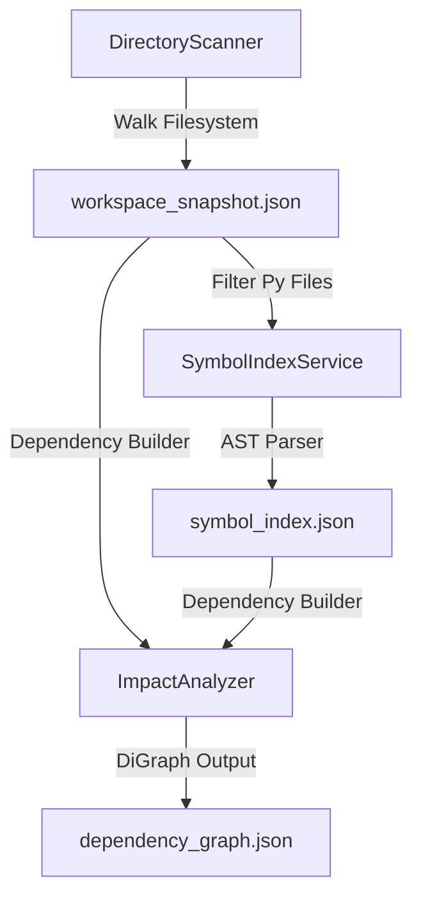

# Workspace Awareness and Codebase Intelligence

Nakama-kun maintains a detailed index of the workspace codebase, combining filesystem metadata, abstract syntax tree (AST) symbol maps, and import dependency graphs. This allows specialized agents to reason about impact dependencies before editing code.

---

## 1. Codebase Metadata Indexing Pipeline

Intelligence indexing runs in three stages when a workspace is analyzed:



### A. Directory traversal & Snapshot
- Filesystem scanning is handled by `DirectoryScanner` (refer to [scanner.py](file:///home/tankaizokuo/Code/Nakama-Kun/src/nakama_kun/workspace/scanner.py)):
  - Iterates through directories, pruning paths matching `ignored_dirs` (e.g. `.git`, `.venv`, `.pytest_cache`, `node_modules`, `.rag`).
  - Limits traversal to `5000` files to prevent hangs on large directories.
  - Constructs `ProjectSnapshot` saving entry points (`main.py`, `app.py`), dependencies, and test file distributions to `.workspace/workspace_snapshot.json`.

### B. AST Symbol Indexing
- Python source file symbols are extracted using `SymbolIndexService` (refer to [symbol_index_service.py](file:///home/tankaizokuo/Code/Nakama-Kun/src/nakama_kun/workspace/symbol_index_service.py)):
  - Traverses Python files, checking modification times (`mtime`) against `symbol_index.json` to invalidate modified nodes.
  - Passes updated sources through `PythonSymbolExtractor` (refer to [symbol_extractor.py](file:///home/tankaizokuo/Code/Nakama-Kun/src/nakama_kun/workspace/symbol_extractor.py)), using Python's standard `ast` module to index class names, functions, and method declarations with their line locations.

### C. Dependency Graph Construction
- Relationships are modeled using `ImpactAnalyzer` (refer to [impact_analyzer.py](file:///home/tankaizokuo/Code/Nakama-Kun/src/nakama_kun/workspace/impact_analyzer.py)):
  - Uses a directed graph `DiGraph` (`networkx`) representing import dependencies between workspace modules.
  - Edge representations denote *import* pathways (Node A imports Node B).

---

## 2. Reasoning and Change Impact Analysis

Before executing file writes, the agent checks change consequences:

### BFS Dependency Analysis
- Changing a function or module signature can cause downstream compilation failures.
- `ImpactAnalyzer._bfs_impact()` traverses the **reversed DiGraph** starting at the target node:
  ```python
  rev_graph = self.graph.reverse()
  # BFS traversal collects all predecessor dependents
  ```
- This determines all upstream files and symbols impacted by changing the target, allowing the Planner Agent to suggest corresponding test runs and edits.

### Workspace Context Builders
- When starting planning, `WorkspaceContextBuilder.build_summary()` parses the snapshot to build a structural markdown block injected into the LLM system prompt.
- This block explains:
  - File trees and entry points.
  - Primary project dependencies.
  - Target modules and test mappings.
- This conditions the LLM to understand the repository structure, allowing it to issue precise file reads rather than guessing paths.
